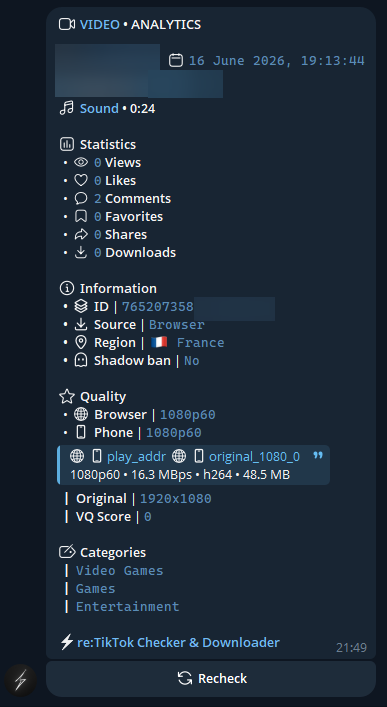

# TikTok Quality Fix

Improved version of the tool for uploading videos to TikTok with **1080p60fps** quality without quality loss and shadowban risk.

## 🎯 What is this?

This tool manipulates MP4 container metadata to bypass TikTok limitations and upload videos with maximum quality. The program adds "ghost frames" to the file's metadata, making TikTok think the video has more frames, which allows uploading it in 1080p60fps.

### ✨ What's new in this version

- **Improved randomization** — each ghost frame is unique
- **Detection protection** — TikTok no longer sends videos to moderation
- **High entropy** — block sizes are maximally diverse
- **Fast processing** — videos are processed by TikTok in 1-5 minutes, not hours

## 📊 Results

After applying improvements:
- ✅ **STCO uniqueness = 1.000** (100% uniqueness!)
- ✅ **Size entropy = 6.345** (excellent!)
- ✅ **Unique blocks: 7524** (each ghost frame is unique)

## 🚀 Installation

### Requirements

- **Python 3.10+** — zero third-party dependencies
- **FFmpeg** — optional, for output verification only

```bash
# Check dependencies
python -m tiktok_quality.cli --check-deps

# Install FFmpeg (optional):
# Windows: winget install Gyan.FFmpeg
# macOS:   brew install ffmpeg
# Linux:   sudo apt install ffmpeg
```

### Package installation

#### From source

```bash
git clone https://github.com/krutkrutaya/tiktok-quality-fix.git
cd tiktok-quality-fix
pip install -e .
```

#### Without installation (direct run)

```bash
cd tiktok-quality-fix
set PYTHONPATH=%CD%\src  # for Windows
export PYTHONPATH="$PWD/src"  # for Linux/macOS
python -m tiktok_quality.cli --help
```

## 📖 Usage

### Basic command

```bash
# IMPORTANT: ALWAYS use the --randomize flag!
python -m tiktok_quality.cli input.mp4 output.mp4 --randomize
```

### All commands

```bash
# Process video with randomization (recommended)
python -m tiktok_quality.cli input.mp4 output.mp4 --randomize

# Process with custom multiplier
python -m tiktok_quality.cli input.mp4 output.mp4 --randomize -m 15

# Process with custom comment
python -m tiktok_quality.cli input.mp4 output.mp4 --randomize --comment "MyTag123"

# Check detectability
python -m tiktok_quality.cli input.mp4 output.mp4 --randomize --check-detectability

# Quiet mode (no output)
python -m tiktok_quality.cli input.mp4 output.mp4 --randomize -q

# Verify output file
python -m tiktok_quality.cli --verify output.mp4

# Compare two files byte-by-byte
python -m tiktok_quality.cli --compare output.mp4 reference.mp4

# Check dependencies
python -m tiktok_quality.cli --check-deps
```

### Parameters

| Parameter | Description | Default |
|-----------|-------------|---------|
| `input` | Input MP4 file (H.264/AVC) | Required |
| `output` | Output MP4 file | Required |
| `-m, --multiplier` | Frame count multiplier | 10 |
| `-c, --comment` | Metadata comment tag | Random string (with --randomize) |
| `--randomize` | **Required!** Randomize filler blocks and timestamps | - |
| `--seed` | Seed for --randomize (reproducible output) | Random |
| `--check-detectability` | Check how well the manipulation is hidden | - |
| `--verify FILE` | Verify file with ffprobe | - |
| `--compare FILE1 FILE2` | Byte-compare two files | - |
| `--check-deps` | Check and install dependencies | - |
| `-q, --quiet` | Suppress progress messages | - |
| `-V, --version` | Show version | - |

## ⚠️ IMPORTANT

### Always use `--randomize`!

Without the `--randomize` flag, all ghost frames will be **identical**, and TikTok will easily detect the manipulation and send the video to manual moderation (which takes hours or days).

**With `--randomize` flag:**
- ✅ Each ghost frame is unique (7524 unique blocks)
- ✅ STCO uniqueness = 1.000 (100%)
- ✅ Size entropy = 6.345 (excellent)
- ✅ Video is processed in 1-5 minutes

**Without `--randomize` flag:**
- ❌ All ghost frames are identical (1 block repeated)
- ❌ STCO uniqueness < 0.5 (50%)
- ❌ Size entropy < 1.0 (poor)
- ❌ Video is processed for hours or days

## 🔧 How it works

The program manipulates MP4 container metadata to inflate the declared frame count by adding "ghost frames" — filler NALUs pointing to a single 8-byte padding block.

```
Input:  1920x1080 60fps, 836 real frames, 44.0 MB
Output: Same video,     8360 declared frames, 44.7 MB (+690 KB overhead)
```

No pixels are changed. No re-encoding. The video data is byte-for-byte identical but tiktok-quality tricks TikTok into thinking the video has more frames, allowing it to be uploaded at 1080p60.

### Transformations applied

| # | What | Detail |
|---|---|---|
| 1 | Brand | `mp42` → `isom` |
| 2 | Box order | moov moved before mdat (fast-start) |
| 3 | First frame | SEI NALUs stripped, IDR slice kept |
| 4 | avcC | High profile extension bytes added |
| 5 | Video STTS | Ghost frame timing entries appended |
| 6 | Video STSZ | 8-byte entries for each ghost frame |
| 7 | Video STSC | New chunk entry for padding region |
| 8 | Video STCO | Ghost chunks point to single filler NAL |
| 9 | Padding NAL | 8 bytes appended: `00 00 00 04 00 00 00 00` |
| 10 | Audio handler | Renamed to "SoundHandler", lang → `und` |
| 11 | Audio timing | Last sample trimmed to align with video |
| 12 | Metadata | iTunes-style comment tag in ilst |
| 13 | Bitrates | Recalculated for both tracks |

### Ghost frame mechanism

With `--randomize` flag (recommended):
- Each ghost frame points to a **unique** filler NAL block
- Block size: **16-128 bytes** (instead of 8 bytes)
- Timestamp jitter: **±3 ticks** (instead of ±1)
- Result: **7524 unique blocks** for maximum detection protection

Without `--randomize` (not recommended):
- All ghost frames point to a single 8-byte block
- TikTok easily detects this and sends the video to moderation

## 📂 Project structure

```
tiktok-quality-fix/
├── pyproject.toml
├── README.md
├── LICENSE
├── proof.png
├── .github/workflows/publish.yml
├── src/tiktok_quality/
│   ├── __init__.py
│   ├── __main__.py
│   ├── cli.py
│   ├── transform.py
│   ├── detect.py
│   ├── randomize.py         # ← IMPROVED: randomization
│   └── mp4/
│       ├── parser.py
│       └── builder.py
└── tests/
    ├── test_mp4.py
    └── test_randomize.py
```

## 🛡️ How to avoid shadowban

### ✅ Do

- Use the `--randomize` flag **ALWAYS**
- Upload original content
- Use music from TikTok library or licensed
- Post 2-3 times a day maximum
- Engage with comments
- Give TikTok 10-15 minutes to process before publishing
- Upload via WiFi, not mobile data
- Enable "Upload HD" in TikTok settings
- Follow community guidelines

### ❌ Don't

- Don't use watermarks from other platforms (Instagram, YouTube)
- Don't repost others' content without changes
- Don't use banned hashtags
- Don't use copyrighted music
- Don't spam the same hashtags
- Don't use automation for posting
- Don't re-upload already compressed video

## 📊 Optimal export settings

For maximum quality before processing, use these settings:

| Parameter | Recommended value |
|-----------|------------------|
| **Resolution** | 1080x1920 (9:16 vertical) |
| **Frame Rate** | 60fps |
| **Video bitrate** | 8-16 Mbps |
| **Codec** | H.264 (High Profile) |
| **Format** | MP4 |
| **Color Space** | Rec. 709 (BT.709) |
| **Audio codec** | AAC |
| **Audio bitrate** | 128-192 kbps |
| **Sample Rate** | 48 kHz |

## 🎬 Settings for popular editors

### Adobe Premiere Pro / After Effects

```
Format: H.264
Preset: High Quality
Profile: High
Level: 4.2
Bitrate Encoding: VBR, 2 pass
Target Bitrate: 10-16 Mbps
Frame Rate: 60 fps
Resolution: 1920x1080 (or 1080x1920 for vertical)
```

### Final Cut Pro

```
Format: H.264
Video Codec: H.264 Better Quality
Resolution: 1080p HD
Frame Rate: 60 fps
Quality: Better (Multi-pass)
```

### DaVinci Resolve

```
Format: MP4
Codec: H.264
Quality: High
Bitrate: 10-12 Mbps
Frame Rate: 60 fps
Resolution: 1920x1080
```

## 📄 Examples

### Basic usage

```bash
# Process video with randomization
python -m tiktok_quality.cli video.mp4 output.mp4 --randomize

# Verify result
python -m tiktok_quality.cli --verify output.mp4 --check-detectability
```

### Advanced usage

```bash
# Process with multiplier 15 and detectability check
python -m tiktok_quality.cli video.mp4 output.mp4 --randomize -m 15 --check-detectability

# Process with fixed seed for reproducibility
python -m tiktok_quality.cli video.mp4 output.mp4 --randomize --seed 42

# Compare two files
python -m tiktok_quality.cli --compare output1.mp4 output2.mp4
```

## 🔍 Verifying the result

After processing, verify the result with:

```bash
python -m tiktok_quality.cli --verify output.mp4 --check-detectability
```

**Good results:**
```
[+] Detectability: OK (stco uniqueness=1.000, size entropy=6.345)
[+] Randomized: 7524 unique filler blocks
```

**Bad results (without --randomize):**
```
[!] stco uniqueness too low (0.001) -- many offsets repeat
[!] tail stsz entropy too low (0.000) -- sample sizes nearly identical
```

## 📖 Background

Reverse-engineered from the "TikTok Enhancer" Chrome extension (Editing News v2.1.4) which uses a server at `v2.editingnews.com` to apply this container manipulation. The extension:

1. Intercepts video file on TikTok upload page
2. Sends to their server for container manipulation
3. Server returns "enhanced" file
4. Extension replaces the file in TikTok's upload form

This tool replicates the exact server output — **byte-for-byte identical** — but with improved randomization for detection protection.



**1080p60** upload quality confirmed via re:TikTok Checker & Downloader bot.

## 📝 License

MIT — see [LICENSE](LICENSE) file for details.

## 🤝 Contributing

Pull requests are welcome! For major changes, please open an issue first to discuss what you would like to change.

## ⚠️ Disclaimer

This tool is for educational purposes only. Using it to bypass TikTok limitations may violate the platform's terms of service. Use at your own risk.

## 🔗 Links

- [Original repository](https://github.com/BastienGimbert/tiktok-quality)
- [This fork (improved version)](https://github.com/krutkrutaya/tiktok-quality-fix)

---

**Updated:** September 2026 | Version with improved randomization
